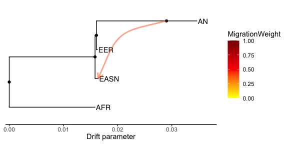
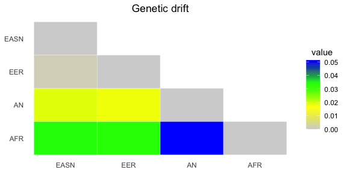
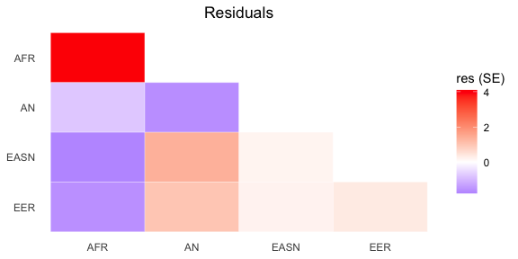

<!-- README.md is generated from README.Rmd. Please edit that file -->

# treemixTools

<!-- badges: start -->
<!-- badges: end -->

The goal of treemixTools is to …

## Installation

You can install the development version of treemixTools from
[GitHub](https://github.com/) with:

``` r
# install.packages("devtools")
devtools::install_github("thehung92/treemixTools")
```

## Example

This code load the treemix result from the package external data. Now my
library can be load with a single `library` function call

``` r
library(treemixTools)
#> Loading required package: aphylo
#> Loading required package: ape
#
infiles <- system.file('extdata', package='treemixTools') |> list.files(full.names=TRUE)
inStem <- infiles[1] |> gsub(pattern=".cov.gz", replacement="")
obj <- read_treemixResult(inStem)
str(obj)
#> List of 13
#>  $ cov     : num [1:4, 1:4] 0.02073 -0.01012 -0.00619 -0.00442 -0.01012 ...
#>   ..- attr(*, "dimnames")=List of 2
#>   .. ..$ : chr [1:4] "AFR" "AN" "EASN" "EER"
#>   .. ..$ : chr [1:4] "AFR" "AN" "EASN" "EER"
#>  $ covse   : num [1:4, 1:4] 0.000516 0.000176 0.000226 0.000266 0.000176 ...
#>   ..- attr(*, "dimnames")=List of 2
#>   .. ..$ : chr [1:4] "AFR" "AN" "EASN" "EER"
#>   .. ..$ : chr [1:4] "AFR" "AN" "EASN" "EER"
#>  $ mod     : num [1:4, 1:4] 0.01987 -0.00996 -0.00583 -0.00409 -0.00996 ...
#>   ..- attr(*, "dimnames")=List of 2
#>   .. ..$ : chr [1:4] "AFR" "AN" "EASN" "EER"
#>   .. ..$ : chr [1:4] "AFR" "AN" "EASN" "EER"
#>  $ resid   : num [1:4, 1:4] 0.000861 -0.00016 -0.000369 -0.000332 -0.00016 ...
#>   ..- attr(*, "dimnames")=List of 2
#>   .. ..$ : chr [1:4] "AFR" "AN" "EASN" "EER"
#>   .. ..$ : chr [1:4] "AFR" "AN" "EASN" "EER"
#>  $ mse     : num 0.00021
#>  $ sse     : num 3.83e-07
#>  $ ssm     : num 0.000102
#>  $ r2      : num 0.996
#>  $ llik    : num 76.7
#>  $ m       : int 1
#>  $ tree    :List of 4
#>   ..$ edge       : int [1:6, 1:2] 5 6 6 7 7 5 6 1 7 2 ...
#>   ..$ edge.length: num [1:6] 0.016652 0.000938 0.000185 0.000233 0.017831 ...
#>   ..$ Nnode      : int 3
#>   ..$ tip.label  : chr [1:4] "EASN" "EER" "AN" "AFR"
#>   ..- attr(*, "class")= chr "phylo"
#>   ..- attr(*, "order")= chr "cladewise"
#>  $ vertices:'data.frame':    8 obs. of  11 variables:
#>   ..$ V1 : int [1:8] 0 1 2 3 4 5 6 10
#>   ..$ V2 : chr [1:8] NA NA NA "EASN" ...
#>   ..$ V3 : chr [1:8] "ROOT" "NOT_ROOT" "NOT_ROOT" "NOT_ROOT" ...
#>   ..$ V4 : chr [1:8] "NOT_MIG" "NOT_MIG" "NOT_MIG" "NOT_MIG" ...
#>   ..$ V5 : chr [1:8] "NOT_TIP" "NOT_TIP" "NOT_TIP" "TIP" ...
#>   ..$ V6 : int [1:8] 0 0 1 1 2 2 0 2
#>   ..$ V7 : int [1:8] 1 3 5 NA NA NA NA 4
#>   ..$ V8 : int [1:8] 3 1 1 NA NA NA NA NA
#>   ..$ V9 : int [1:8] 6 2 4 NA NA NA NA NA
#>   ..$ V10: int [1:8] 1 2 1 NA NA NA NA NA
#>   ..$ V11: chr [1:8] "((EASN:0.00097325,(EER:0.00019637,AN:0.0185516):0.000252552):0.0158357,AFR:0.0158357);" "(EASN:0.00097325,(EER:0.00019637,AN:0.0185516):0.000252552):0.0158357" "(EER:0.00019637,AN:0.0185516):0.000252552" "EASN:0.00097325" ...
#>  $ edges   :'data.frame':    8 obs. of  7 variables:
#>   ..$ V1: int [1:8] 0 0 2 10 10 1 1 2
#>   ..$ V2: int [1:8] 1 6 5 4 3 3 2 10
#>   ..$ V3: num [1:8] 0.015836 0.015836 0.000196 0.005627 0 ...
#>   ..$ V4: num [1:8] 1 1 1 1 0.397 ...
#>   ..$ V5: chr [1:8] "NOT_MIG" "NOT_MIG" "NOT_MIG" "NOT_MIG" ...
#>   ..$ V6: num [1:8] 0 0 0 0.697 0.697 ...
#>   ..$ V7: num [1:8] 1 1 1 1 0 ...
```

## plot the graph with ggtree

``` r
plot_treemix_graph(obj)
#> Registered S3 method overwritten by 'treeio':
#>   method          from  
#>   as.phylo.matrix aphylo
```



## plot the drift params heatmap

``` r
plot_treemix_drift(obj)
```



## plot the residual heatmap

``` r
plot_treemix_residual(obj)
```



## merge
