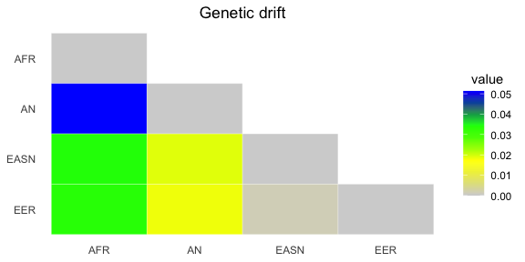

<!-- README.md is generated from README.Rmd. Please edit that file -->

# treemixTools

<!-- badges: start -->
<!-- badges: end -->

The goal of treemixTools is to visualize treemix result with ggplot2
packages

## Installation

You can install the development version of treemixTools from
[GitHub](https://github.com/) with:

``` r
# install.packages("devtools")
devtools::install_github("thehung92/treemixTools")
```

## Example

This code load the treemix result from the package external data. Now my
library can be load with a single `library` function call

``` r
library(treemixTools)
#> Loading required package: aphylo
#> Loading required package: ape
library(tidyverse)
#> ── Attaching packages
#> ───────────────────────────────────────
#> tidyverse 1.3.2 ──
#> ✔ ggplot2 3.4.0      ✔ purrr   0.3.5 
#> ✔ tibble  3.1.8      ✔ dplyr   1.0.10
#> ✔ tidyr   1.2.1      ✔ stringr 1.4.1 
#> ✔ readr   2.1.3      ✔ forcats 0.5.2 
#> ── Conflicts ────────────────────────────────────────── tidyverse_conflicts() ──
#> ✖ dplyr::filter() masks stats::filter()
#> ✖ dplyr::lag()    masks stats::lag()
library(patchwork)
#
infiles <- system.file('extdata', package='treemixTools') |> list.files(full.names=TRUE)
inStem <- infiles[1] |> gsub(pattern=".cov.gz", replacement="")
obj <- read_treemixResult(inStem)
names(obj)
#>  [1] "cov"      "covse"    "mod"      "resid"    "mse"      "sse"     
#>  [7] "ssm"      "r2"       "llik"     "m"        "tree"     "vertices"
#> [13] "edges"
```

## plot the graph with ggtree

``` r
fig.tree <- plot_treemix_graph(obj)
#> Registered S3 method overwritten by 'treeio':
#>   method          from  
#>   as.phylo.matrix aphylo
fig.tree
```


## plot the drift params heatmap

``` r
fig.drift <- plot_treemix_drift(obj)
fig.drift
```



## plot the residual heatmap

``` r
fig.resid <- plot_treemix_residual(obj)
fig.resid
```


## merge

``` r
fig.tree + fig.drift + fig.resid +
  plot_layout(ncol=1, nrow=3) +
  plot_annotation(tag_levels = 'A') & theme(legend.justification = "left")
```


